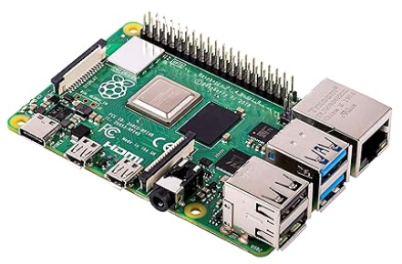
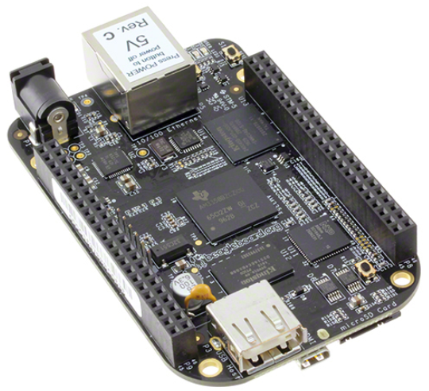
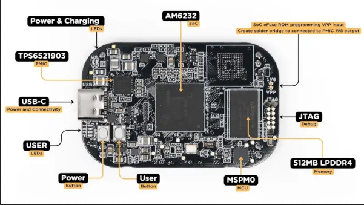

# The kaiwanTECH 'Writing Linux Device Drivers' Training Course
This GitHub repo (and a few others) contain the prereqs, lab setup (hardware & software), and the reference source code for this course.

## IMPORTANT : Participant PREREQUSITES !
  - Successfully completed the 'Linux Kernel Internals & Module Development' (L2-LVC) course -or- have the equivalent skill sets: at a minimum: Linux OS architecture, basics of writing a Loadable Kernel Module (LKM), clear VM concepts, kernel memory (de)alloc APIs, at least the basic kernel synchronization mechanisms (mutex & spinlock), etc
  - Good working knowledge of the 'C' programming language
  - Optional / Advantageous: Experience working in kernel-space and/or embedded Linux helps.

*To aid with the prereqs*, the instructor will provide a few PDFs that cover the really essential prereq topics before session commencement. If not provided to you after enrollment, pl contact the instructor and request access to the same.

Practically, **it's important that, bare minimum, you try out in a hands-on manner and understand** the following LKMs (Loadable Kernel Modules):
- [hello, world](https://github.com/kaiwan/L2_kernel_trg/tree/master/helloworld_lkm)
- [show monolithic](https://github.com/kaiwan/L2_kernel_trg/tree/master/show_monolithic)
- [Memory: slab (de)alloc basics](https://github.com/PacktPublishing/Linux-Kernel-Programming_2E/blob/main/ch8/slab1/slab1.c)
- [Memory: slab (de)alloc, actual memory size used](https://github.com/PacktPublishing/Linux-Kernel-Programming_2E/tree/main/ch8/slab4_actualsize)
- [Locking: mutex lock basic usage](https://github.com/PacktPublishing/Linux-Kernel-Programming_2E/tree/main/ch12/1_miscdrv_rdwr_mutexlock)
- [Locking: spinlock basic usage](https://github.com/PacktPublishing/Linux-Kernel-Programming_2E/tree/main/ch12/2_miscdrv_rdwr_spinlock)
 

## GitHub repos used for this course
- [This one](https://github.com/kaiwan/L3_dd_trg)
- [labrat drivers](https://github.com/kaiwan/labrat_drv)
- [LKP Part 2 book repo](https://github.com/PacktPublishing/Linux-Kernel-Programming-Part-2)
- [drv_johannes (cloned)](https://github.com/kaiwan/drv_johannes)
 

## Lab Setup

### Suggested HARDWARE for this course

#### PC or laptop
- **Ensure** you have access to a ‘test’ Linux system. It can be a Virtual Machine
(VM) running off a Windows/Linux/MacOS host, or (preferably for the 'Embedded Linux & Yocto' courses) a stand-alone native Linux system.

- We generally recommend using a recent Ubuntu LTS release (f.e. Ubuntu 22.04 LTS), though other recent distros (Fedora/Debian/...) should be okay as well.
  - For details on installing an Ubuntu Linux VM, please refer [this Lab Setup document](https://docs.google.com/document/d/1XCOHltTdT-KiIpFZ45agFoe-kg4orauw8zgj5myzuHE/edit?usp=sharing).

**TL;DR:**
- The latest version of the Lab Setup doc’s [here](https://docs.google.com/document/d/1XCOHltTdT-KiIpFZ45agFoe-kg4orauw8zgj5myzuHE/edit?usp=sharing)
- [kaiwanTECH YouTube](https://www.youtube.com/@kaiwanTECH) tutorial: [Setting up an Ubuntu Linux VM](https://youtu.be/_tkbHk8RW0A?t=447).

#### Embedded board (SBC) and other hardware

Though not mandatory, it will help tremendously if you have matching (or close) hardware to what will be taught and demonstrated during the course, thus allowing you to get an awesome hands-on experience:
An embedded target board, a **Single Board Computer (SBC)**; *any one of these is fine*:
  - **Raspberry Pi** (any model: Pi Zero, 3B, 4 or 5) ; f.e., **[Raspberry Pi  Model 4B]**(https://robu.in/product/raspberry-pi-4-model-b-with-2-gb-ram/?gad_source=1&gad_campaignid=19974686076&gclid=CjwKCAiA95fLBhBPEiwATXUsxEPqE-CULNrikSsWpAHbdnJgmfJ0pPNGYA_uCGqKIH8Nauk-EQSxnBoCjSkQAvD_BwE)
  
  - **[TI BeagleBone Black (Aarch32)](https://robu.in/product/beaglebone-black-rev-c/?gad_source=1&gad_campaignid=17413441824&gclid=CjwKCAiA95fLBhBPEiwATXUsxMBen3ml-z1AWmhhFxl0BkPgq2geHqvOff2-EQH0ta5qzO8G78emdRoCyfAQAvD_BwE)**
  
  - **[TI PocketBeagle 2 (Aarch64)](https://robu.in/product/beagleboard-pocketbeagle-2-p-n-102110780-sbc/?gad_source=1&gad_campaignid=17413441824&gclid=CjwKCAiA95fLBhBPEiwATXUsxC0lj6wPSNFyrJQlmac1IU_W5oXRubSN9JsVNIJYsStA5iP3EV6YhhoC1Q8QAvD_BwE)**
  
  - We expect you have the USB/power cable, microSD card, with the OS pre-installed on it. (If unaware, just Google for resources related to stuff like this.)

You will learn to write Linux device drivers for these sensors/devices (among other driver types. Note that the suggested links below are India-centric, you can of course purchase these from any preferred appropriate e-comm site or store):
- [DHT22 Digital Temperature & Humidity Sensor](https://robu.in/product/dht22-am2302-digital-temperature-humidity-sensor/) 
  
- [OLED SSD1306 display module](https://robu.in/product/0-96-inch-yellow-yellow-blue-oled-lcd-led-display-module/#tab-specification)
  
        
- [USB Wireless laser presenter (input driver for it’s buttons)](https://www.amazon.in/rts-2019-2020-Presenter-Powerpoint-Controller/dp/B07XZJ93MG/ref=asc_df_B07XZJ93MG?mcid=ec02fb9f13d23bedad780ba82eee7176&tag=googleshopdes-21&linkCode=df0&hvadid=709855510680&hvpos=&hvnetw=g&hvrand=9907410614774729867&hvpone=&hvptwo=&hvqmt=&hvdev=c&hvdvcmdl=&hvlocint=&hvlocphy=9061995&hvtargid=pla-836869392441&psc=1&gad_source=1)
  
- Breadboard, jumper wires, a few LEDs, a pushbutton or two, 1k resistor.

*(You’ll understand that we have no relationship with the hardware suppliers shown here and hence cannot guarantee price, availability, quality.)*

 

## Useful resources
- [Book: Linux Kernel Programming, 2nd Ed (LKP2E), Kaiwan N Billimoria, Packt (covers 6.1 LTS)](https://www.amazon.in/Linux-Kernel-Programming-practical-synchronization/dp/1803232226/ref=sr_1_1?crid=1UFTE2D6FTUNS&dib=eyJ2IjoiMSJ9.GkJuQ4o6XWJDsMwuSu0ugBQ1pAqeW1wYw469K0poCzvCIiakShI47reOKQx8rcbzI5cQkfFwwZSmj_NxYMmFSnSkrnT5XnUysMA1gf0c59zC55J-7yfYWnMxuTWWeLbP.582BXVieyNIZnLSEcdmbx1zKXQjrrW2RGq633CxTvMg&dib_tag=se&keywords=linux+kernel+programming+by+kaiwan+n+billimoria&qid=1768287025&sprefix=linux+ke%2Caps%2C357&sr=8-1)
  - [LKP 2E book GitHub repo](https://github.com/PacktPublishing/Linux-Kernel-Programming_2E/tree/main)
  - [Further reading resources - for the LKP 2E book](https://github.com/PacktPublishing/Linux-Kernel-Programming_2E/blob/main/Further_Reading.md)
- [**Free ebook PDF!** Download the 'Linux Kernel Programming - Part 2' ebook PDF; 'Char Device Drivers and Kernel Synchronization'](https://github.com/PacktPublishing/Linux-Kernel-Programming/blob/master/Linux-Kernel-Programming-(Part-2)/Linux%20Kernel%20Programming%20Part%202%20-%20Char%20Device%20Drivers%20and%20Kernel%20Synchronization_eBook.pdf)
